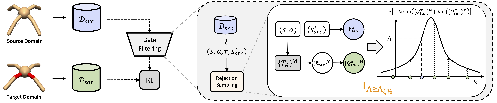

# Cross-domain Policy Adaptation via Value-guided Data Filtering

This is the official code for the paper ["Cross-domain Policy Adaptation via Value-guided Data Filtering"](https://arxiv.org/abs/2305.17625). 



## Train 

Train VGDF in *HalfCheetah - broken back thigh* with:

```
python script/train_vgdf.py --env halfcheetah --seeds 12
```

Train VGDF_BC in *HalfCheetah - no thighs* with:

```
python script/train_vgdf_bc.py --env halfcheetah_morph --seeds 12
```

You can tune any hyperparameters in the `config` for experiments.

## References
```bib
@inproceedings{xu2023cross,
  title={Cross-domain Policy Adaptation via Value-guided Data Filtering},
  author={Xu, Kang and Bai, Chenjia and Ma, Xiaoteng and Wang, Dong and Zhao, Bin and Wang, Zhen and Li, Xuelong and Li, Wei},
  booktitle = {Advances in Neural Information Processing Systems},
  year = {2023}
}
```